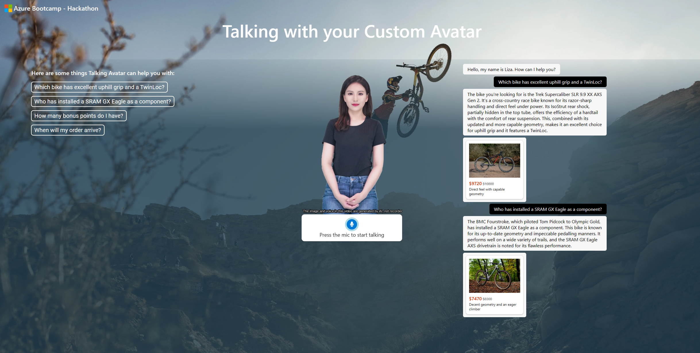
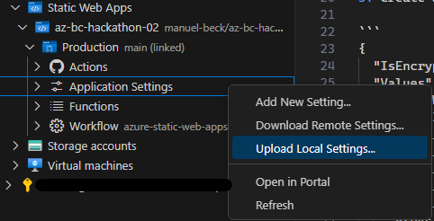

# Talking Avatar with your Custom Avatar



This demo shows a talking custom avatar.  The components used are Azure OpenAI in combination with data stored on Cognitive Search and Azure SQL to generate answers.

## Preparation 

1. Clone this repository

2. Create the following Azure resources:

    - Azure OpenAI Service with these models deployed
      -  gpt-35-turbo (note: **version 0613 or higher is required**)
      - text-embedding-ada-002 (version 2)
   - Azure AI Search with default settings   
   - Azure Speech Service
   - Azure AI services multi-service account

3. Create a file named `local.settings.json` in the `api` directory of the repository. Make sure to add the following variables to `local.settings.json`. The `AzureWebJobsStorage` variable can be left empty for development purposes.

```
{
  "IsEncrypted": false,
  "Values": {
    "AzureWebJobsStorage": "",
    "FUNCTIONS_WORKER_RUNTIME": "python",
    "AZURE_OPENAI_ENDPOINT": "https://XXX.openai.azure.com/",
    "AZURE_OPENAI_API_KEY": "XXX",
    "AZURE_OPENAI_CHAT_DEPLOYMENT" : "gpt-35-turbo-16k",
    "AZURE_OPENAI_EMBEDDINGS_DEPLOYMENT" : "text-embedding-ada-002",
    "AZURE_OPENAI_API_VERSION" : "2023-07-01-preview",
    "AZURE_SEARCH_ENDPOINT": "https://XXX.search.windows.net",
    "AZURE_SEARCH_API_KEY": "XXX",
    "AZURE_SEARCH_INDEX": "products",
    "AZURE_SPEECH_REGION": "westeurope",
    "AZURE_SPEECH_API_KEY": "XXX",
    "TEXT_ANALYTICS_ENDPOINT": "XXX",
    "TEXT_ANALYTICS_KEY": "XXX",
    "BLOB_SAS_URL": "https://XXX",
    "SQL_DB_SERVER": "XXX.database.windows.net",
    "SQL_DB_USER": "XXX",
    "SQL_DB_PASSWORD": "XXX",
    "SQL_DB_NAME": "HackathonDB"
  }
}
```
4. Run the cells in the `create-index.ipynb` notebook to upload the product data to Azure AI Search and the Azure SQL Database.

5. In case you are using an Azure Speech Services instance in a region different from `westeurope`, update line 17 of `main.js` in the `src/js` folder to reflect that.

6. This application can be deployed using Azure Static Web Apps. Refer to this [quickstart](https://docs.microsoft.com/azure/static-web-apps/getting-started?tabs=vanilla-javascript).

    If you are using **Visual Studio Code**, you can execute the following steps:
    - Install  the Azure Static Web Apps and Azure Functions extensions
    - Right-click on Static Web Apps extension folder, select **Create Static Web App ... (Advanced)** with the following parameters:  

      | Parameter                 | Description                                                      |
      |---------------------------|------------------------------------------------------------------|
      | Resource group            | Select an existing resource group or create a new one            |
      | Name                      | Choose a name                                 |
      | Pricing option            | Standard                                                         |
      | Region                    | Select the same or a nearby region as for the above resources    |
      | Framework                 | Custom                                                           |
      | Application code location | /src                                           |
      | Build output location     | (Leave blank)                                                    |      


8. In the VSCode Static Web Apps extension, navigate to **Application Settings** of your app and right-click **Upload Local Settings**. This will populate the settings from `local.settings.json` to the web app.
 
    

8. In the VSCode Static Web Apps extension, right-click on your app name and select **Browse site** to use the app